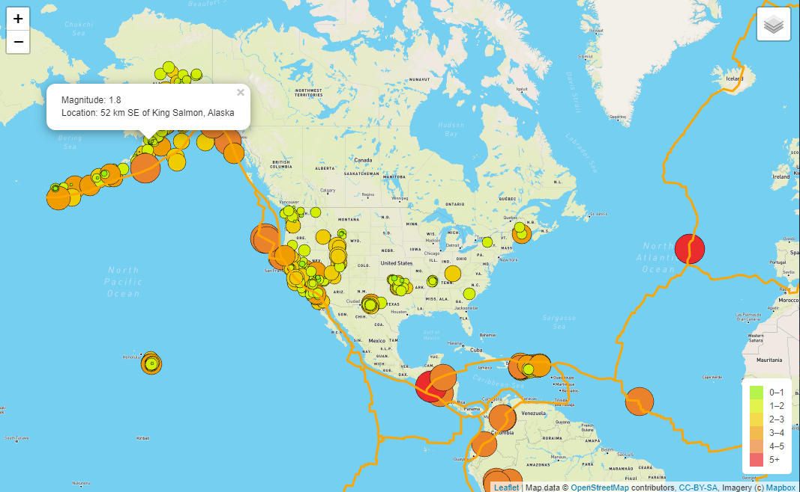

# Mapping_Earthquakes
## Overview
Creating an interactive web page that tracks earthquakes.

## Resources
### Data sources:
* [Tectonic Plate GeoJSON](https://raw.githubusercontent.com/fraxen/tectonicplates/master/GeoJSON/PB2002_boundaries.json)
* [Earthquakes above 4.5mag GeoJson](https://earthquake.usgs.gov/earthquakes/feed/v1.0/summary/4.5_week.geojson)
* [Earthquakes GeoJson](https://earthquake.usgs.gov/earthquakes/feed/v1.0/summary/all_week.geojson)

### Software
* D3 Library
* Leaflet Library
* HTML/CSS
* Javascript
* Visual Studio Code

## Results
This project required creating a mapbox account and retrieve access to an API token and linking the index to the API key found in the config.js file.
As shown below, I created an interactive map with three different layers to view from.

